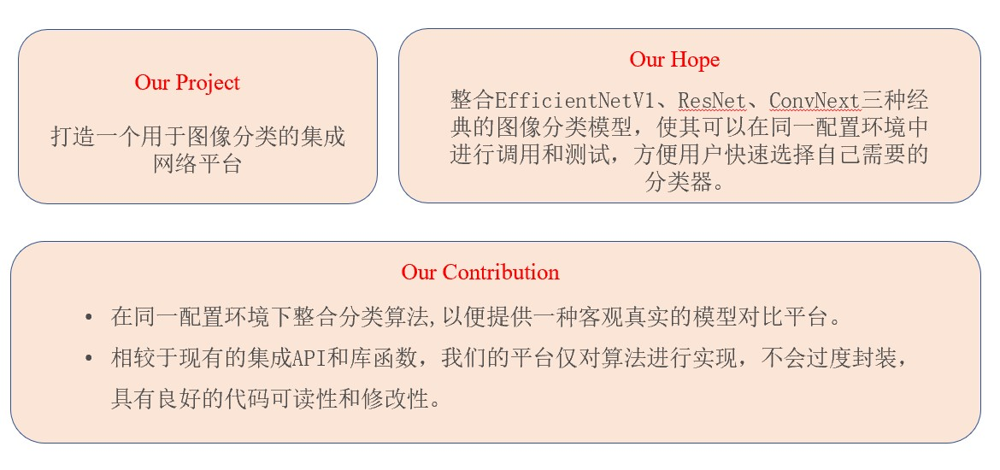

# 项目简介
本项目为提供了一套用于图像分类的集成网络平台，平台内置了resnet、convnext和efficientnet三种经典的网络模型。在实现一个分类任务时，可以根据任务的特性实现一键调用指定的网络模型，减低选择模型的工程量，提高任务效率。

# 代码结构
项目分为configs、core、datas、models、tools、utils和weights文件夹，各个文件夹存在的作用为：

1. configs文件夹包含了构成一个算法模型的所有必要源码。例如其中的backbones子文件夹中存储着三种模型的工程源码；basic中集成一些在实现神经网络时必要的功能函数；heads和necks集成封装模型时必要的头部和颈部代码
2. core文件夹中包含了算法评价指标、权重初始化和优化器的实现源码
3. datas文件夹中用于存放项目使用的数据集，以及通用初始权重文件：mobilenet_v3_small.pth
4. models文件夹主要定义了三种算法模型，用来声明模型的结构并调用configs中的底层程序
5. tools文件夹中集成了项目的主要调用接口文件，包括模型的训练train、测试test、评估evaluation程序
6. utils文件夹集成了一些其它的程序文件
7. weights文件用于存放模型训练好的权重文件

# 启动方式
- 下载数据集：https://pan.baidu.com/share/init?surl=137y4l-J3AgyCiC_cXqIqw 提取码：0zat。将数据集下载解压后放在datas目录下，目前已经提前准备好了类别记录文件annotations，测试和训练图片目录文件。如果想训练其它数据要做出相应的替换。
- 打开tools文件夹中的train.py文件，在第23行中填入自己需要训练的模型路径文件后进行训练。
- 训练好后可以使用同文件夹中的test文件进行测试、evaluation文件进行评估